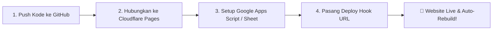

# 🚀 Panduan Lengkap & Mudah: Deploy AstroCMS ke Live (100% Gratis)

Panduan ini memandu Anda langkah-demi-langkah mendeploy website **AstroCMS** ke internet secara **Live** menggunakan **Cloudflare Pages** (atau **Netlify / Vercel**), menghubungkan database Google Sheets, dan mengaktifkan fitur otomatis **Deploy Hook** (Auto-rebuild saat publish artikel).

---

## 📋 Ringkasan Alur Kerja



---

## LANGKAH 1: Push Repository ke GitHub

1. Buka [GitHub.com](https://github.com) dan buat repository baru (misalnya: `my-astrocms`).
2. Di terminal komputer Anda, jalankan perintah berikut:
   ```bash
   git remote add origin https://github.com/USERNAME-ANDA/my-astrocms.git
   git branch -M main
   git push -u origin main
   ```

---

## LANGKAH 2: Deploy ke Cloudflare Pages (Rekomendasi Utama — Gratis & Cepat)

Cloudflare Pages memberikan **bandwidth unlimited gratis**, CDN global super cepat, dan SSL/HTTPS otomatis.

1. Buka [dash.cloudflare.com](https://dash.cloudflare.com/) dan login/daftar akun.
2. Di menu sebelah kiri, klik **Workers & Pages** &rarr; **Create application** &rarr; tab **Pages** &rarr; **Connect to Git**.
3. Pilih repository GitHub Anda (`my-astrocms`).
4. Isi pengaturan build (*Build settings*) seperti berikut:
   - **Framework preset:** `Astro`
   - **Build command:** `npm run build`
   - **Build output directory:** `dist`
5. Di bagian **Environment Variables (Variabel Lingkungan)**, tambahkan variabel berikut (sesuaikan jika ada):
   - `PUBLIC_SITE_URL`: `https://domain-anda.pages.dev` (atau domain kustom Anda)
   - `PUBLIC_API_URL`: *(URL Google Apps Script Anda, lihat Langkah 3)*
   - `PUBLIC_CLOUDINARY_CLOUD_NAME`: *(Opsional, jika menggunakan Cloudinary untuk upload gambar)*
   - `PUBLIC_CLOUDINARY_PRESET`: *(Opsional)*
6. Klik **Save and Deploy**. Dalam 1–2 menit, website Anda sudah **LIVE** di alamat `https://my-astrocms.pages.dev`!

---

## LANGKAH 3: Setup Google Sheets sebagai Database (Headless CMS)

Agar artikel yang Anda tulis di Admin Dashboard tersimpan permanen di cloud (bukan hanya di browser):

1. Buat **Google Spreadsheet** baru di [Google Drive](https://sheets.google.com).
2. Buat sheet/tab bernama:
   - `posts` (Kolom: `id`, `title`, `slug`, `category`, `status`, `image`, `excerpt`, `content`, `tags`, `disable_ads`, `published_at`, `updated_at`)
   - `products` (Kolom: `id`, `name`, `slug`, `price`, `discount_price`, `category`, `status`, `image`, `description`, `updated_at`)
   - `settings` (Kolom: `key`, `value`)
3. Buka menu **Extensions** &rarr; **Apps Script**.
4. Paste kode API script penghubung (*Google Apps Script Web App*), lalu klik **Deploy** &rarr; **New Deployment** &rarr; tipe **Web App**.
   - *Execute as:* **Me**
   - *Who has access:* **Anyone**
5. Salin **Web App URL** yang dihasilkan (contoh: `https://script.google.com/macros/s/AKfycb.../exec`).
6. Masukkan URL tersebut ke **Environment Variable** di Cloudflare Pages:
   `PUBLIC_API_URL` = `https://script.google.com/macros/s/AKfycb.../exec`

---

## LANGKAH 4: Pasang Deploy Webhook (Auto-Rebuild saat Publish Artikel)

Ini adalah fitur terpenting agar setiap kali Anda klik **Publish Artikel** di Admin, website otomatis di-build ulang oleh Cloudflare:

1. Di dashboard Cloudflare Pages Anda, buka menu **Settings** &rarr; **Builds & deployments**.
2. Scroll ke bagian **Deploy hooks**, lalu klik **Add deploy hook**.
3. Beri nama: `Admin CMS Publish`, lalu pilih branch `main`. Klik **Create hook**.
4. Salin URL Webhook yang diberikan (contoh: `https://api.cloudflare.com/client/v4/pages/webhooks/deploy_hooks/xxxx-xxxx`).
5. Buka Admin Dashboard website Anda di `/admin/settings` &rarr; tab **🚀 Deploy & Hosting**.
6. Paste URL Webhook tersebut ke kolom **Deploy Hook URL**, lalu klik **💾 Simpan Semua Pengaturan**.

---

## LANGKAH 5: Menghubungkan Domain Kustom (Opsional)

Jika Anda sudah memiliki domain sendiri (contoh: `pempekilen.com`):
1. Di Cloudflare Pages, buka tab **Custom domains** &rarr; **Set up a custom domain**.
2. Masukkan nama domain Anda.
3. Ikuti petunjuk DNS (tambahkan CNAME record yang diarahkan ke Cloudflare Pages).
4. SSL/HTTPS akan aktif otomatis dalam hitungan menit.

---

## 🎯 Cara Kerja Setelah Live

| Aksi Anda di Admin | Apa yang Terjadi di Balik Layar? |
|---|---|
| **Menulis & Mengunggah Gambar** | Gambar otomatis diunggah ke Cloudinary/Storage eksternal. |
| **Klik "Simpan Artikel" (Published)** | Data disimpan ke Google Sheets & Admin otomatis memanggil Deploy Hook. |
| **Cloudflare Pages Menerima Sinyal** | Cloudflare menjalankan `astro build` otomatis dalam ~30 detik. |
| **Pengunjung Membuka Website** | Pengunjung langsung membaca artikel baru dengan kecepatan kilat (100% Statis & Aman dari serangan hacker). |

---

## 💡 Alternatif Platform Hosting Lain

Jika Anda lebih menyukai platform selain Cloudflare:
- **Netlify:**
  - Build command: `npm run build`
  - Output directory: `dist`
  - Deploy hook: Menu *Build & Deploy* &rarr; *Continuous Deployment* &rarr; *Build hooks*.
- **Vercel:**
  - Framework: `Astro`
  - Deploy hook: Menu *Settings* &rarr; *Git* &rarr; *Deploy Hooks*.
