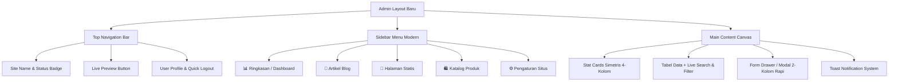

# 🎨 Rencana Peningkatan UI/UX Admin Dashboard — Clean, Simple & Symmetrical

Dokumen ini merinci rancangan perombakan antarmuka (*User Interface*) dan pengalaman pengguna (*User Experience*) untuk **Admin Dashboard AstroCMS**. Tujuannya adalah menciptakan dashboard yang **modern, rapi, simetris, ringan, dan mudah digunakan oleh orang awam (pengguna umum)** tanpa mengorbankan fungsionalitas teknis.

---

## 1. Prinsip Desain Utama (Design Principles)

1. **Clean & Minimalist (Fokus pada Konten)**
   - Menghilangkan elemen visual yang berlebihan (*visual clutter*), border tebal, dan teks bantuan yang terlalu panjang.
   - Menggunakan *white-space* yang lega (spasi yang pas) agar mata pengguna tidak cepat lelah.

2. **Simetris & Konsisten (Symmetrical Grid)**
   - Semua halaman mengikuti grid 8px standar: padding, margin, radius kartu, dan ukuran font seragam.
   - Header halaman, tombol aksi utama (*Primary Action*), dan tabel berada di posisi yang konsisten di semua menu.

3. **User-Friendly untuk Orang Awam (Intuitive UX)**
   - Mengganti pop-up browser bawaan (`alert()`, `confirm()`) dengan **Modal Dialog Modern** dan **Toast Notification** mengambang yang elegan.
   - Filter & Pencarian instan untuk artikel/produk sehingga pengguna tidak kesulitan mencari data lama.
   - Tab navigasi untuk halaman Pengaturan (*Settings*) agar form tidak menumpuk panjang ke bawah.

4. **Mobile & Tablet Responsive**
   - Sidebar dapat ditutup (*collapsible*) atau dibuka via tombol menu hamburger di layar kecil.

---

## 2. Struktur Visual & Komponen Baru



---

## 3. Rincian Perubahan Per Halaman

### A. Admin Layout & Navigasi Global (`AdminLayout.astro` & `admin.css`)
* **Warna & Tema:**
  - Sidebar: Palet *Dark Slate* modern (`#0f172a`) atau opsi *Clean Light Slate* yang lembut.
  - Background Canvas: Abu-abu netral lembut (`#f8fafc`).
  - Kartu & Permukaan: Putih bersih (`#ffffff`) dengan border tipis 1px (`#e2e8f0`) dan bayangan halus (*subtle shadow*).
  - Aksen Warna: Biru Indigo / Brand Orange yang profesional dan tegas.
* **Top Navigation Bar:**
  - Status koneksi database (*Online / Demo Mode*).
  - Tombol pintas cepat **"Lihat Website"** dengan ikon rapi.
  - Avatar inisial admin dan tombol logout yang bersih.
* **Sistem Notifikasi Toast:**
  - Toast mengambang di pojok kanan-bawah saat simpan berhasil (`✅ Artikel berhasil disimpan`), gagal, atau saat deploy webhook terkirim.

---

### B. Dashboard Overview (`/admin`)
* **Kartu Statistik Simetris (4-Kolom):**
  - Total Artikel, Total Draft, Total Produk, dan Status Engine SSG.
  - Ikon dengan latar belakang pastel lembut, angka tebal yang mudah dibaca, dan label yang jelas.
* **Action Bar / Quick Tools:**
  - Baris tombol simetris dengan ikon jelas: `+ Tulis Artikel`, `+ Tambah Produk`, `⚙️ Pengaturan`, `🚀 Rebuild Web`.
* **Tabel Aktivitas Terbaru:**
  - Menampilkan 5 artikel & produk terakhir dengan status pill (🟢 *Published*, 🟡 *Draft*).

---

### C. Kelola Artikel (`/admin/posts`)
* **Pencarian & Filter Cepat:**
  - Input pencarian langsung (*Live Search*) berdasarkan judul.
  - Dropdown filter status (*Semua*, *Published*, *Draft*) dan filter kategori.
* **Tabel Postingan yang Rapi:**
  - Thumbnail gambar mini berbentuk rounded square (44x44px).
  - Kolom judul jelas + link slug URL warna muted.
  - Tombol aksi: Tombol ikon `Edit` dan `Hapus` dengan warna yang sopan dan rapi.
  - *Empty State*: Ilustrasi kosong + tombol ajakan bertindak (*Call to Action*) jika belum ada artikel.
* **Form Editor Artikel (2-Kolom / Split Card):**
  - **Kolom Kiri (Utama):** Judul Artikel, Slug URL otomatis, Ringkasan (Excerpt), dan Editor Konten artikel yang lapang.
  - **Kolom Kanan (Sidebar Pengaturan Artikel):**
    - Kotak Status Publikasi (*Published / Draft*).
    - Dropzone Gambar Utama dengan tombol *Drag & Drop*, *Browse*, atau *Paste URL*.
    - Kategori & Tags.
    - Switch/Toggle: *Nonaktifkan Iklan pada artikel ini* (Clean Toggle Switch).

---

### D. Kelola Produk & Menu (`/admin/products`)
* **Tampilan Grid / Tabel Simetris:**
  - Pilihan tampilan: Tabel rapi atau Kartu Produk (*Grid View*).
  - Format harga otomatis berformat Rupiah (`Rp 85.000`).
  - Badge diskon yang kontras dan informatif (`Diskon Rp 15.000`).
* **Form Tambah Produk:**
  - Input Nama Produk, Kategori, Harga Normal, Harga Coret/Promo, Upload Foto, dan Deskripsi Menu.

---

### E. Kelola Halaman Statis (`/admin/pages`)
* Tampilan list halaman utama (`Tentang Kami`, `Kontak`, `Kebijakan Privasi`, dll).
* Editor konten halaman yang fokus tanpa distraksi.

---

### F. Pengaturan Website (`/admin/settings`) — *Tabbed Interface*
Daripada menumpuk seluruh form ke bawah yang membuat pengguna harus scroll panjang, kita membaginya ke dalam **5 Tab Rapi**:
1. 🏷️ **Umum**: Nama Situs, Tagline, Deskripsi, No. WhatsApp, Email, Akun Sosial Media.
2. 🔍 **SEO & Indexing**: Google Search Console code, Bing IndexNow Key, Default OG Image.
3. 📢 **Monetisasi & Iklan**: Toggle iklan artikel/homepage, interval paragraf, kode slot Header, In-Content, dan Footer.
4. 🚀 **Deploy & Build**: Deploy Hook URL (Cloudflare/Netlify) + Tombol tes trigger langsung.
5. 📊 **Custom Scripts**: Google Analytics 4, Tag Manager, Meta Pixel.
* **Sticky Save Bar:** Tombol Simpan selalu terlihat di bawah layar tanpa perlu scroll ke ujung bawah.

---

### G. Halaman Login (`/login`)
* Card login modern terpusat di tengah layar (*Centred Floating Card*).
* Tombol 1-Klik Demo yang rapi dan terpisah jelas dari form login manual.

---

## 4. Rencana Tahapan Implementasi

| No | Tahap | Deskripsi Tindakan |
|---|---|---|
| **1** | **Refactor Core CSS** | Memperbarui `src/styles/admin.css` dengan design tokens baru (grid 8px, clean palette, form components, toggle switches, toast styles, table hover states). |
| **2** | **Update Admin Layout** | Memperbarui `src/layouts/AdminLayout.astro` (sidebar rapi, topbar seragam, toast notification container, avatar & status). |
| **3** | **Dashboard Refinement** | Mempercantik `src/pages/admin/index.astro` (kartu statistik simetris, quick bar, clean table). |
| **4** | **Post & Product UX** | Merombak form editor di `posts/index.astro` dan `products/index.astro` menjadi layout 2-kolom yang simetris + live search filter. |
| **5** | **Settings Tabbed View** | Mengubah `src/pages/admin/settings/index.astro` menjadi sistem tab interaktif dengan sticky save bar. |
| **6** | **Build & QA Verification** | Memastikan semua fungsi CRUD, upload gambar, auth, ads slot, dan build SSG tetap berjalan 100% normal dan mulus. |

---

## 5. Mockup Pratinjau Antarmuka Baru

````carousel
```
+-----------------------------------------------------------------------------------+
| [Logo] CMS Admin   | 🟢 Status: Online     [🌐 Lihat Website]  [👤 Admin] [🚪 Logout] |
+--------------------+--------------------------------------------------------------+
| 📊 Dashboard       | 📝 Kelola Artikel                                [+ Buat Artikel] |
| 📝 Artikel Blog    | -------------------------------------------------------------|
| 📄 Halaman Statis  | [ 🔍 Cari judul artikel... ]  [ Filter Status: Semua v ]     |
| 🛍️ Katalog Produk  | -------------------------------------------------------------|
| ⚙️ Pengaturan      | [Foto]  Judul Artikel          | Kategori | Status    | Aksi     |
|                    | [ 🖼️ ] Resep Pempek Kapal Selam| Kuliner  | [Published]| ✏️  🗑️    |
|                    | [ 🖼️ ] 5 Tips Menggoreng Kulit | Tips     | [Draft]   | ✏️  🗑️    |
+--------------------+--------------------------------------------------------------+
```
<!-- slide -->
```
+-----------------------------------------------------------------------------------+
| Edit Artikel: Resep Pempek Kapal Selam                                   [ X ]     |
+----------------------------------------------------+------------------------------+
| [ KONTEN UTAMA ]                                   | [ PENGATURAN ARTIKEL ]       |
|                                                    |                              |
| Judul Artikel:                                     | Status Publikasi:            |
| [ Resep Pempek Kapal Selam Lengkap             ]   | [ Published (Tayang)    v ]  |
|                                                    |                              |
| Slug URL:                                          | Foto Utama (Thumbnail):      |
| [ resep-pempek-kapal-selam-lengkap             ]   | +--------------------------+ |
|                                                    | |   🖼️ [ Foto Preview ]     | |
| Ringkasan Singkat (Excerpt):                       | | [Ganti Foto] [Hapus Foto]| |
| [ Panduan membuat pempek kapal selam anti bocor]   | +--------------------------+ |
|                                                    |                              |
| Isi Artikel:                                       | Kategori:                    |
| [ Markdown / Teks Editor ..................... ]   | [ Kuliner                  ] |
| [ ............................................ ]   |                              |
| [ ............................................ ]   | Monetisasi Iklan:            |
| [ ............................................ ]   | [x] Nonaktifkan Iklan        |
+----------------------------------------------------+------------------------------+
| [ Batal ]                                                    [ 💾 Simpan Artikel ]|
+-----------------------------------------------------------------------------------+
```
<!-- slide -->
```
+-----------------------------------------------------------------------------------+
| ⚙️ Pengaturan Website                                                              |
| [ 🏷️ Umum ]  [ 🔍 SEO & Index ]  [ 📢 Slot Iklan ]  [ 🚀 Deploy ]  [ 📊 Scripts ] |
+-----------------------------------------------------------------------------------+
| Form Pengaturan Tab Aktif Terbuka di Sini...                                       |
| - Simpel, terorganisir per kategori                                               |
| - Tidak perlu scroll panjang ke bawah                                             |
+-----------------------------------------------------------------------------------+
|                                                 [ 💾 Simpan Semua Pengaturan ]    |
+-----------------------------------------------------------------------------------+
```
````
